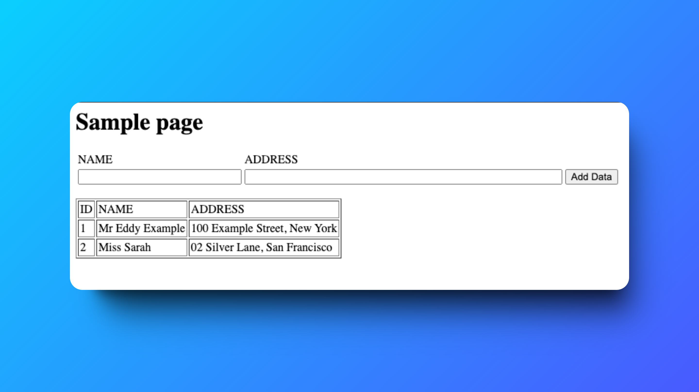

# Connect a Web App with Aurora 🌐📊

---

## Introducing Today's Project!

In this project, I connected a **Web App** hosted on an EC2 instance to an **Amazon Aurora Database**, enabling the app to interact with stored data effectively. The project involved setting up the database, configuring the web server, and verifying seamless data flow between the application and the database.

---

## What is Amazon Aurora?

Amazon Aurora is a fully managed relational database compatible with **MySQL** and **PostgreSQL**. It provides high performance, scalability, and availability while automating backups, scaling, and patching. Aurora delivers faster performance and cost savings compared to traditional database systems.

---

## Project Overview

This project involved:

- Setting up an Amazon Aurora database to store **employee records**.
- Creating a web app hosted on an EC2 instance that interacts with the database.
- Implementing functionalities to **add, retrieve, and display employee data**.

  
*Figure: Architecture diagram showcasing the connection between the web app on EC2 and the Aurora database.*

---

## How I Used Amazon Aurora in This Project

To complete this project:

1. **Aurora Setup**: I configured an Amazon Aurora database and created the `EMPLOYEES` table to store employee data.
2. **EC2 Instance**: I launched an EC2 instance to host the web app, setting up the necessary tools like Apache, PHP, and MariaDB.
3. **Web App Development**: I created a PHP-based web app with a form for data entry and a table to display existing records from the database.
4. **Integration**: Connected the app to the Aurora database using a `dbinfo.inc` file containing connection details.

---

## One Thing I Didn't Expect...

I was pleasantly surprised by how smoothly the integration between the web app and the Aurora database went. The automation features of Aurora simplified connection setup and data management, saving me time and effort.

---

## Step-by-Step Details

### 1. Creating the Web App

To build the web app:

- I installed the **Apache web server**, **PHP**, and the **php-mysqli extension** to enable interaction with the Aurora database.
- Developed a PHP script (`SamplePage.php`) with a user-friendly form for entering employee names and addresses.

---

### 2. Connecting the Web App to Aurora

To connect the web app:

- I used **Windows PowerShell** to SSH into the EC2 instance with my `.pem` key and public DNS.
- Created a `dbinfo.inc` file with Aurora's database endpoint, username, password, and database name, which the PHP app used for database operations.

---

### 3. Upgrading the Web App

The upgrade involved:

- Creating a form on the **SamplePage.php** file for adding employee names and addresses.
- Displaying existing records from the **EMPLOYEES** table dynamically.

---

### 4. Testing the Web App

To ensure functionality:

- I tested the web app in a browser by submitting employee data through the form.
- Verified that the data was successfully added to the database by connecting to Aurora via **MySQL CLI** and querying the `EMPLOYEES` table.

  
*Figure: Testing the web app by adding employee records.*

---

## Time Taken

The project took approximately **1 hour**, including:

- Setting up the EC2 instance.
- Configuring the Aurora database.
- Developing the web app with all necessary functionalities.

---

## Acknowledgments

Special thanks to **NextWork.org** for providing the guidance and resources to complete this project successfully.

---

## Author

**Hassan Gachoka**  

---
